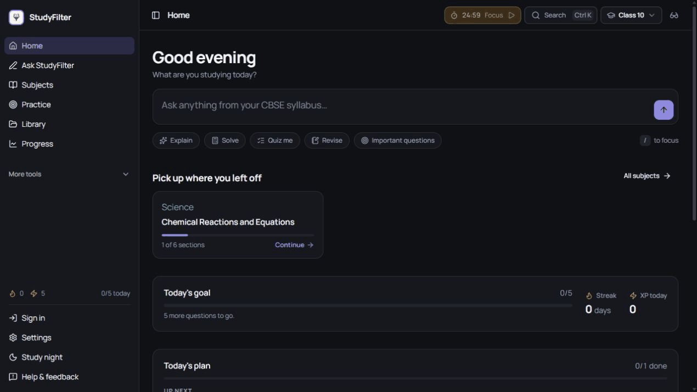
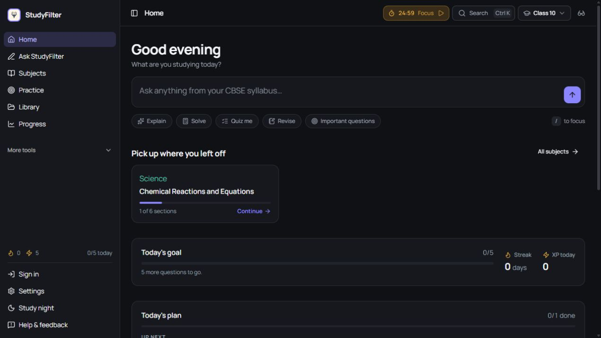
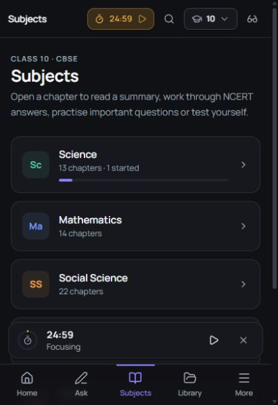
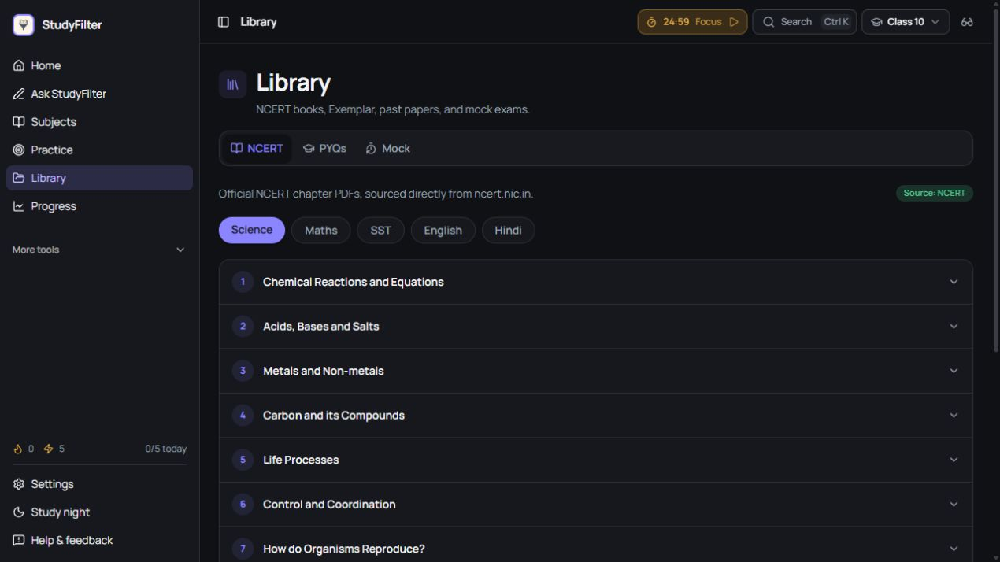
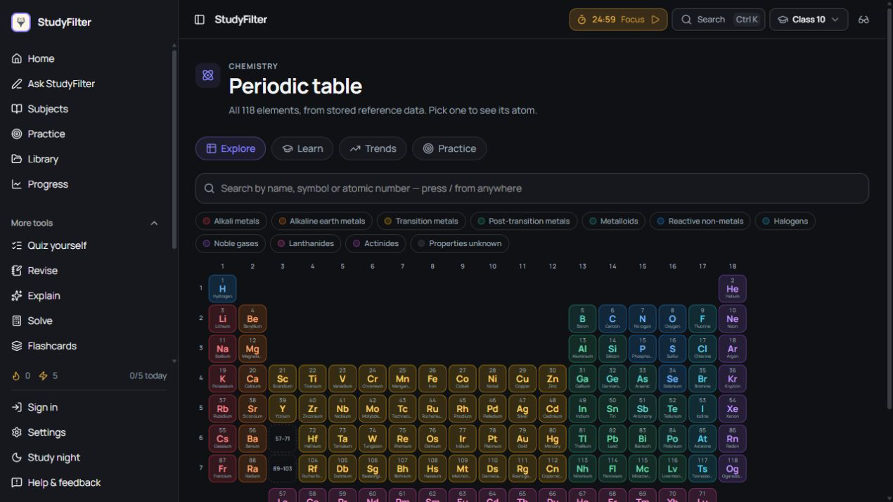
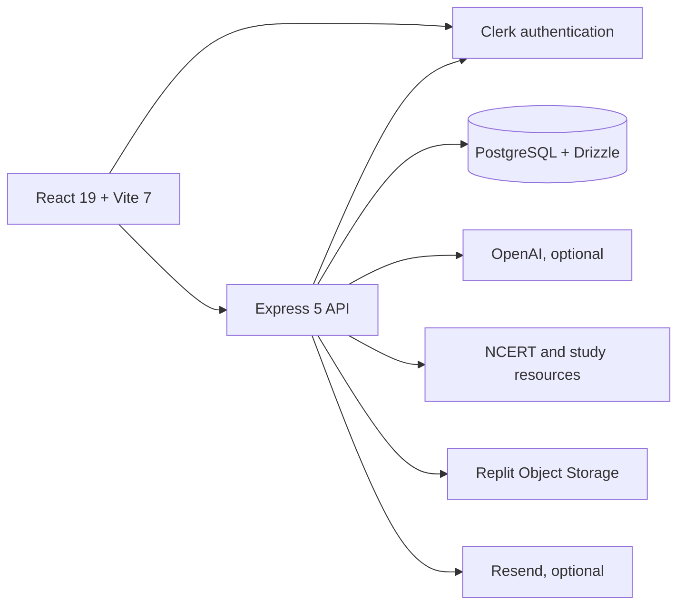

<div align="center">
  
  <h1>StudyFilter</h1>
  <p><strong>A focused CBSE learning workspace for Classes 8–12.</strong></p>
  <p>Ask, understand, revise, practise, and track progress without hopping between disconnected study tools.</p>

  <p>
    <a href="https://studyfilter.online"><strong>Open the live app</strong></a>
    ·
    <a href="#access-and-licensing">Source terms</a>
  </p>

  <p>
    
    
    
    
    
  </p>
</div>



## What StudyFilter brings together

- **Ask StudyFilter** — exam-ready, syllabus-aware answers with mathematical notation and structured explanations.
- **Subject workspaces** — Class 8–12 CBSE chapters, summaries, NCERT answers, important questions, quizzes, and revision notes.
- **Independent study tools** — quiz, revise, explain, solve, flashcards, comparison, maps, and an interactive periodic table.
- **Practice and assessment** — question practice, previous-year papers, mock exams, marking schemes, and performance analysis.
- **Official NCERT library** — chapter PDFs with a resilient server proxy and official-source fallback.
- **Progress loop** — goals, streaks, XP, mastery, recent activity, daily plans, focus timer, and leaderboard.
- **Responsive learning UI** — a desktop workspace and a purpose-built mobile navigation experience with light and dark themes.

## Product snapshots

| Focused home workspace | Mobile subject browser |
|:--:|:--:|
|  |  |

| NCERT library | Interactive periodic table |
|:--:|:--:|
|  |  |

## Architecture



This repository is a pnpm workspace:

```text
artifacts/
├── study-filter/       # React/Vite application
├── api-server/         # Express API and document services
└── mockup-sandbox/     # Isolated UI prototyping surface
lib/
├── api-client-react/   # Generated React API client
├── api-spec/           # OpenAPI source
├── api-zod/            # Generated runtime schemas
├── cbse-content/       # Curriculum and learning content
└── db/                 # Drizzle schema and database access
scripts/                # Import, prewarm, and maintenance tools
docs/media/             # Repository screenshots and product tour
```

## Access and licensing

> **Proprietary source — all rights reserved.** This repository is not open source. Repository access does not grant permission to download, copy, run, modify, redistribute, publish, sell, or host its source code for personal, private, educational, non-profit, or commercial use. Prior express written permission from the owner is required. Attribution alone is not permission.

The public may use the official hosted application through its normal interface at [studyfilter.online](https://studyfilter.online). That website access does not grant rights to its code, assets, or data.

See the [StudyFilter Proprietary Source Code License](LICENSE) for the complete terms and permission-request requirements.

## Configuration

| Variable | Purpose | Required |
|---|---|:--:|
| `VITE_CLERK_PUBLISHABLE_KEY` | Browser-side Clerk authentication | Yes |
| `CLERK_PUBLISHABLE_KEY` | API-side Clerk configuration | Yes |
| `CLERK_SECRET_KEY` | Server authentication and user management | Yes |
| `DATABASE_URL` | PostgreSQL connection | Yes |
| `OPENAI_API_KEY` | AI-generated study assistance | Optional |
| `OPENAI_MODEL` | Answer model override | Optional |
| `RESEND_API_KEY` | Feedback and support email delivery | Optional |
| `RESEND_WEBHOOK_SECRET` | Inbound email webhook verification | Optional |
| `PORT` | Frontend or API listening port | Runtime |
| `BASE_PATH` | Frontend hosting base path | Optional |

Downloaded exam PDFs are intentionally excluded from Git. The application serves library documents through approved sources or object storage; contributors should not commit third-party PDFs.

## Authorised collaboration

Development and contributions are limited to collaborators expressly authorised by the owner. See [CONTRIBUTING.md](CONTRIBUTING.md). Please use [SECURITY.md](SECURITY.md) for vulnerability reports rather than public issues.

## Disclaimer

StudyFilter is an independent educational project and is not affiliated with or endorsed by CBSE or NCERT. Curriculum names and document links belong to their respective owners. Always verify current syllabus and examination guidance with official sources.

## Copyright

Copyright © 2026 Hamshamb / StudyFilter. All rights reserved. The source is governed by the [StudyFilter Proprietary Source Code License](LICENSE). Third-party dependencies and educational materials remain subject to their respective owners' terms.
